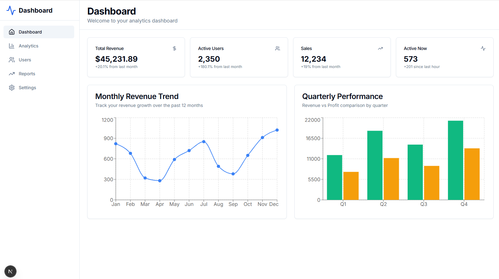

# NextJS Dashboard with Shadcn UI

A powerful, modern dashboard built with NextJS 16, TypeScript, Tailwind CSS, and Shadcn UI components. This project showcases the capabilities of Shadcn UI with multiple chart types and a responsive dashboard layout.



## Features

- 🚀 **NextJS 16** with App Router
- ⚡ **TypeScript** for type safety
- 🎨 **Tailwind CSS** for styling
- 🧩 **Shadcn UI** components
- 📊 **Recharts** for data visualization
- 📱 **Responsive** design
- 📊 **Interactive Charts**: Line and Bar charts with realistic data
- 🎨 **Modern UI** with clean design
- 📈 **Analytics Dashboard** with stats cards

## Chart Components

1. **Line Chart** - Monthly revenue trend with realistic fluctuations
2. **Bar Chart** - Quarterly performance comparison (Revenue vs Profit)

## Getting Started

1. Install dependencies:
```bash
npm install
```

2. Run the development server:
```bash
npm run dev
```

3. Open [http://localhost:3000](http://localhost:3000) in your browser

## Project Structure

```
src/
├── app/
│   ├── globals.css
│   ├── layout.tsx
│   └── page.tsx
├── components/
│   ├── charts/
│   │   ├── bar-chart.tsx
│   │   └── line-chart.tsx
│   ├── dashboard/
│   │   ├── sidebar.tsx
│   │   └── stats-cards.tsx
│   └── ui/
│       ├── button.tsx
│       └── card.tsx
└── lib/
    └── utils.ts
```

## Technologies Used

- **NextJS 16** - React framework
- **TypeScript** - Type safety
- **Tailwind CSS** - Utility-first CSS
- **Shadcn UI** - Component library
- **Recharts** - Chart library
- **Lucide React** - Icons
- **Radix UI** - Headless UI primitives

## Available Scripts

- `npm run dev` - Start development server
- `npm run build` - Build for production
- `npm run start` - Start production server
- `npm run lint` - Run ESLint

## License

MIT
